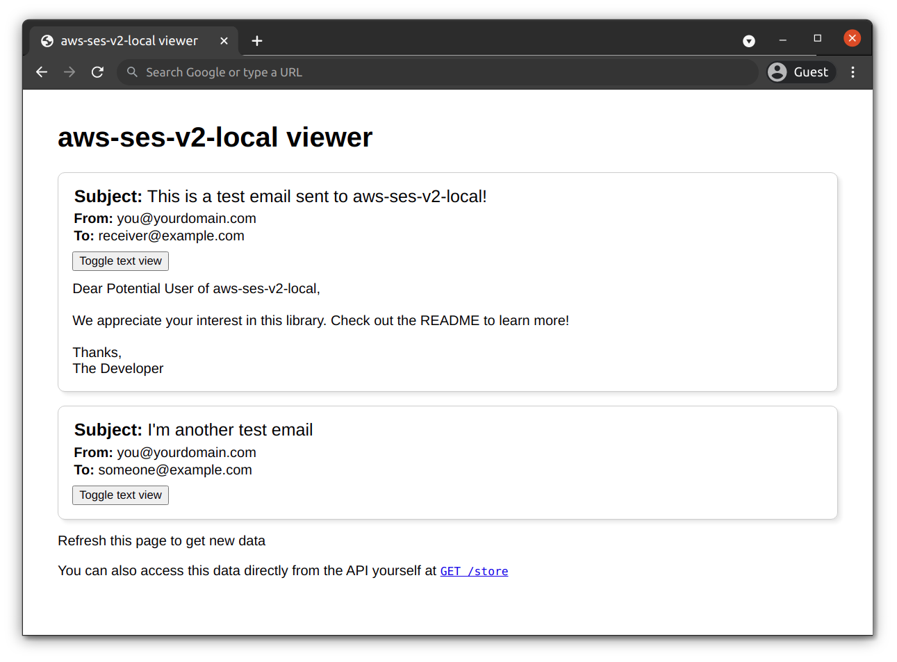

# aws-ses-v2-local

A local version of Amazon Simple Email Service (AWS SES) supporting the [V2 API](https://docs.aws.amazon.com/ses/latest/APIReference-V2/Welcome.html). Currently focuses on the SendEmail endpoint.

Are you using serverless-offline? You might be interested in [serverless-offline-ses-v2](https://github.com/domdomegg/serverless-offline-ses-v2).



## Install

```
npm install aws-ses-v2-local
```

## Usage

### Setting up aws-ses-v2-local

You can run it as a command line tool (in your package.json scripts, or install it globally with the `-g` flag)

```
aws-ses-v2-local
```

Alternatively, you can import it and run it yourself (along with optional config for the port):

```typescript
import server from 'aws-ses-v2-local'

server({ port: 8005 })
console.log('The aws-ses-v2-local server is up and running!')
```

### Setting up your application

You can treat the server as an AWS SES endpoint. For example in JavaScript/TypeScript with the V3 SDK:

```typescript
import { SESv2Client, SendEmailCommand, SendEmailCommandInput } from "@aws-sdk/client-sesv2"

const sesClient = new SESv2Client({ endpoint: "http://localhost:8005" })
const command = new SendEmailCommand({
    Content: {
        Simple: {
            Body: { Text: { Data: 'This is the email contents' } },
            Subject: { Data: 'This is the subject' }
        }
    },
    Destination: { ToAddresses: ['receiver@example.com'] },
    FromEmailAddress: 'sender@example.com',
})
const data = await sesClient.send(command)
```

Or with the V2 SDK:

```typescript
import AWS from 'aws-sdk'

const sesClient = new AWS.SESV2({ endpoint: "http://localhost:8005" })
const params = {
    Content: {
        Simple: {
            Body: { Text: { Data: 'This is the email contents' } },
            Subject: { Data: 'This is the subject' }
        }
    },
    Destination: { ToAddresses: ['receiver@example.com'] },
    FromEmailAddress: 'sender@example.com',
}
sesClient.sendEmail(params)
```

### Viewing emails

Navigate to the address and port where the server is running in your browser (e.g. [`localhost:8005`](http://localhost:8005/)).
