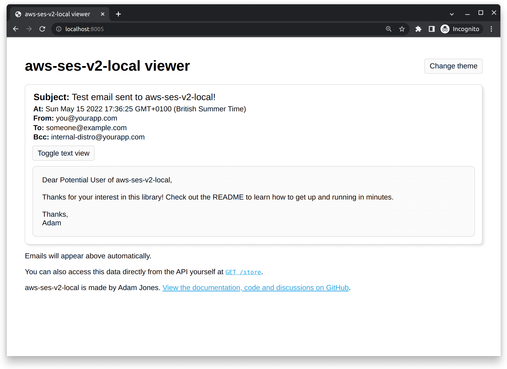
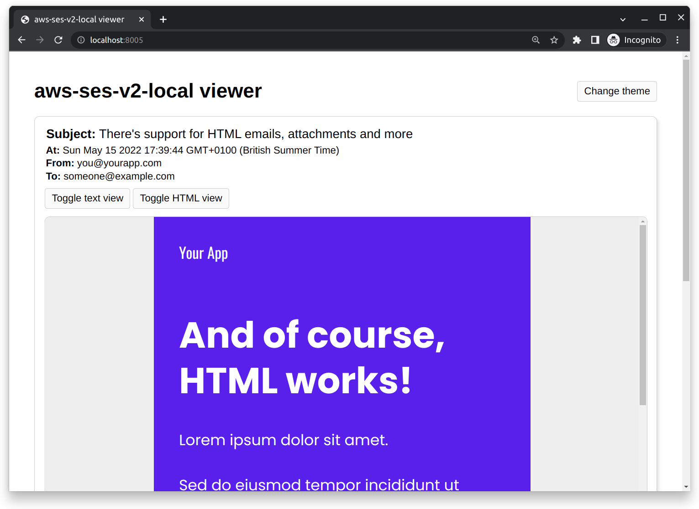
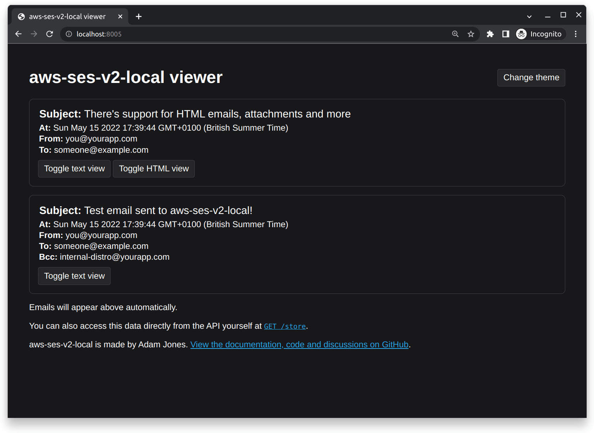

# aws-ses-v2-local

A local version of Amazon Simple Email Service (AWS SES) supporting both the [V1 API](https://docs.aws.amazon.com/ses/latest/APIReference/Welcome.html) and the [V2 API](https://docs.aws.amazon.com/ses/latest/APIReference-V2/Welcome.html). Currently focuses on the SendEmail and SendRawEmail endpoints.

Are you using serverless-offline? You might be interested in [serverless-offline-ses-v2](https://github.com/domdomegg/serverless-offline-ses-v2).



| HTML emails | Dark theme |
| - | - |
|  |  |

## Features

- SES V1 SendEmail endpoint
- SES V1 SendRawEmail endpoint
- SES V2 SendEmail endpoint (both Simple and Raw)
- SES V2 createEmailTemplate endpoint
- SES V2 deleteEmailTemplate endpoint
- SES V2 getAccount endpoint (returns the content of the AWS_SES_ACCOUNT env variable)
- SES V2 sendBulkEmail endpoint (only supports simple placeholder replacement)
- Realistic API responses, compatible with the AWS SDK (in JavaScript/TypeScript/Node.js, Java, Python, Go, C++, .NET, PHP, Ruby) and the AWS CLI
- To, Cc, Bcc, ReplyTo and From addresses
- Plain text and HTML emails
- Accept and view attachments
- Built in web viewer, with live inbox, optional dark theme, and compatibility with all emails
- API access to emails at `GET /store`
- Health check endpoint at `GET /health-check`
- Control it from the CLI, or import it as a library
- TypeScript definitions
- Emails can be forwarded to a SMTP server via the SMTP_TRANSPORT env variable

## Install

```
npm install aws-ses-v2-local
```

## Usage

### Setting up aws-ses-v2-local

Run it as a command line tool (in your package.json scripts, or install it globally with `npm install -g aws-ses-v2-local`)

```
aws-ses-v2-local
```

Alternatively, you can import it and run it yourself (along with optional config for the port):

```typescript
import server from 'aws-ses-v2-local'

server({ port: 8005 })
console.log('aws-ses-v2-local: server up and running')
```

### Setting up your application

You can treat the server as an AWS SES endpoint. See the starter for your language:

<details>
<summary>JavaScript/TypeScript for the V2 API with the V3 SDK (recommended)</summary>

```typescript
import { SESv2Client, SendEmailCommand } from "@aws-sdk/client-sesv2"

const ses = new SESv2Client({
    endpoint: 'http://localhost:8005',
    region: 'aws-ses-v2-local',
    credentials: { accessKeyId: 'ANY_STRING', secretAccessKey: 'ANY_STRING' },
});
await ses.send(new SendEmailCommand({
    FromEmailAddress: 'sender@example.com',
    Destination: { ToAddresses: ['receiver@example.com'] },
    Content: {
        Simple: {
            Subject: { Data: 'This is the subject' },
            Body: { Text: { Data: 'This is the email contents' } },
        }
    },
}))
```

</details>

<details>
<summary>JavaScript/TypeScript for the V1 API with the V3 SDK</summary>

```typescript
import { SES, SendEmailCommand } from '@aws-sdk/client-ses'

const ses = new SES({
    endpoint: 'http://localhost:8005',
    region: 'aws-ses-v2-local',
    credentials: { accessKeyId: 'ANY_STRING', secretAccessKey: 'ANY_STRING' },
})
await ses.send(new SendEmailCommand({
    Source: 'sender@example.com',
    Destination: { ToAddresses: ['receiver@example.com'] },
    Message: {
        Subject: { Data: 'This is the subject' },
        Body: { Text: { Data: 'This is the email contents' } },
    },
}))
```

</details>

<details>
<summary>JavaScript/TypeScript for the V2 API with the V2 SDK</summary>

```typescript
import AWS from 'aws-sdk'

const ses = new AWS.SESV2({
    endpoint: 'http://localhost:8005',
    region: 'aws-ses-v2-local',
    credentials: { accessKeyId: 'ANY_STRING', secretAccessKey: 'ANY_STRING' },
})
ses.sendEmail({
    FromEmailAddress: 'sender@example.com',
    Destination: { ToAddresses: ['receiver@example.com'] },
    Content: {
        Simple: {
            Subject: { Data: 'This is the subject' },
            Body: { Text: { Data: 'This is the email contents' } },
        }
    },
})
```

</details>

<details>
<summary>JavaScript/TypeScript with nodemailer for the V1 raw API with the V3 SDK</summary>

```typescript
import * as aws from '@aws-sdk/client-ses'

const ses = new aws.SES({
    endpoint: 'http://localhost:8005',
    region: 'aws-ses-v2-local',
    credentials: { accessKeyId: 'ANY_STRING', secretAccessKey: 'ANY_STRING' },
})
const transporter = nodemailer.createTransport({ SES: { ses, aws } })

await transporter.sendMail({
    from: 'sender@example.com',
    to: ['receiver@example.com'],
    subject: 'This is the subject',
    text: 'This is the email contents',
    attachments: [{
        filename: `some-file.pdf`,
        contentType: 'application/pdf',
        content: Buffer.from(pdfBytes),
    }],
})
```

</details>

Using another language or version? Submit a PR to update this list :)

### Viewing emails

Navigate to the address and port where the server is running in your browser (e.g. [`localhost:8005`](http://localhost:8005/)).

### Docker

A Dockerfile that bakes the `/dist/cli.js` is provided. There is also a `docker-compose.example.yml` template to create a container running the aws-ses-v2-local mock server.
